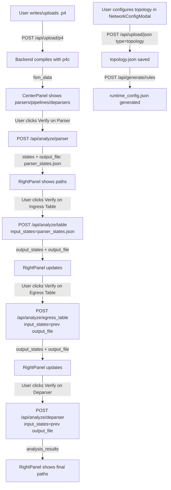

# P4SymTest — Backend Connection Points

## Infrastructure

| Item | Value |
|---|---|
| Backend base URL (Docker) | `http://backend:5000/api` |
| Backend base URL (local dev) | `http://localhost:5000/api` |
| Env variable | `VITE_API_URL` (defined in [docker-compose.yml](file:///home/teste/Documents/symtest/p4symtest/docker-compose.yml)) |
| CORS | Enabled globally in [app.py](file:///home/teste/Documents/symtest/p4symtest/backend/app.py) |

> [!IMPORTANT]
> The frontend currently has **zero real API calls**. All data is served from static mock files in `src/mocks/` via [src/lib/mockData.ts](file:///home/teste/Documents/symtest/p4symtest/frontendV2/src/lib/mockData.ts). Every integration point below must be built from scratch.

---

## API Endpoints Reference

### 1. Upload — P4 Source File
**`POST /api/upload/p4`** → [app.py:74](file:///home/teste/Documents/symtest/p4symtest/backend/app.py#L74)

**Frontend trigger**: "Compile Program" button in [CenterPanel.tsx:65](file:///home/teste/Documents/symtest/p4symtest/frontendV2/src/components/CenterPanel.tsx#L65)

```
Request:  multipart/form-data  { file: <.p4 file> }
Response: { message, fsm_data }   // fsm_data = full compiled JSON (programa.json)
Errors:   400 compile error, 500 file read error
```

**What to replace**: [handleCompile()](file:///home/teste/Documents/symtest/p4symtest/frontendV2/src/components/CenterPanel.tsx#14-18) currently sets `setCompiledData(mockData.compiledStructures)`.
Must → upload file to this endpoint and use `response.fsm_data` as `compiledData`.

---

### 2. Upload — JSON Files (FSM / Topology / Runtime / States)
**`POST /api/upload/json`** → [app.py:118](file:///home/teste/Documents/symtest/p4symtest/backend/app.py#L118)

**Frontend trigger**: Not yet implemented (future file drop / import feature in [LeftPanel](file:///home/teste/Documents/symtest/p4symtest/frontendV2/src/components/LeftPanel.tsx#5-105))

```
Request:  multipart/form-data  { file: <.json>, type: "fsm"|"topology"|"runtime_config"|"parser_states" }
Response: { message, type, filename }
```

---

### 3. Analyze — Parser
**`POST /api/analyze/parser`** → [app.py:160](file:///home/teste/Documents/symtest/p4symtest/backend/app.py#L160)

**Frontend trigger**: "Verify" button for a **parser** node in [CenterPanel](file:///home/teste/Documents/symtest/p4symtest/frontendV2/src/components/CenterPanel.tsx#6-160) ([handleVerifyNode("parser", name)](file:///home/teste/Documents/symtest/p4symtest/frontendV2/src/components/CenterPanel.tsx#19-30))

```
Request:  {} (empty body, files already uploaded)
Response: { message, states: [...], parser_info, state_count, output_file }
```

**What to replace**: `RightPanel.tsx:267` returns `logs.parserStates` (mock).
Must → call this endpoint; use `response.states` as the paths array.

---

### 4. Analyze — Reachability
**`POST /api/analyze/reachability`** → [app.py:203](file:///home/teste/Documents/symtest/p4symtest/backend/app.py#L203)

**Frontend trigger**: Could be triggered after compile to annotate structures in [CenterPanel](file:///home/teste/Documents/symtest/p4symtest/frontendV2/src/components/CenterPanel.tsx#6-160).

```
Request:  {} (empty body)
Response: { message, reachability: { [tableName]: { conditions, reachable } } }
```

**What to replace**: Currently not wired anywhere. Reachability badges/info in the UI will use this.

---

### 5. Generate — Runtime Rules
**`POST /api/generate/rules`** → [app.py:260](file:///home/teste/Documents/symtest/p4symtest/backend/app.py#L260)

**Frontend trigger**: Submit action in `NetworkConfigModal` (after the user configures the topology).

```
Request:  {} (topology.json and programa.json already uploaded)
Response: { message, rules }   // rules = runtime_config.json content
```

**What to replace**: `NetworkConfigModal` currently only stores config in React state (localStorage). Must → serialize to `topology.json`, upload via endpoint #2, then call this endpoint to generate [runtime_config.json](file:///home/teste/Documents/symtest/p4symtest/runtime_config.json).

---

### 6. Analyze — Ingress Table
**`POST /api/analyze/table`** → [app.py:286](file:///home/teste/Documents/symtest/p4symtest/backend/app.py#L286)

**Frontend trigger**: "Verify" button for a **table** node in an **Ingress** pipeline in [CenterPanel](file:///home/teste/Documents/symtest/p4symtest/frontendV2/src/components/CenterPanel.tsx#6-160).

```
Request:  JSON { table_name, switch_id, input_states: "<filename>_output.json" }
Response: { message, results_summary, output_states: [...], output_file }
```

**What to replace**: `RightPanel.tsx:273-276` returns hardcoded mock JSON.
Must → call this with `table_name`, `switch_id` (from config), and `input_states` (last `output_file` in chain).

---

### 7. Analyze — Egress Table
**`POST /api/analyze/egress_table`** → [app.py:408](file:///home/teste/Documents/symtest/p4symtest/backend/app.py#L408)

**Frontend trigger**: "Verify" button for a **table** node in an **Egress** pipeline in [CenterPanel](file:///home/teste/Documents/symtest/p4symtest/frontendV2/src/components/CenterPanel.tsx#6-160).

```
Request:  JSON { table_name, switch_id, input_states: "<filename>_output.json" }
Response: { message, output_states: [...], output_file }
```

**What to replace**: Same as #6 but matched by pipeline name `"egress"`. `RightPanel.tsx:279-283`.

---

### 8. Analyze — Deparser
**`POST /api/analyze/deparser`** → [app.py:468](file:///home/teste/Documents/symtest/p4symtest/backend/app.py#L468)

**Frontend trigger**: "Verify" button for a **deparser** node in [CenterPanel](file:///home/teste/Documents/symtest/p4symtest/frontendV2/src/components/CenterPanel.tsx#6-160).

```
Request:  JSON { input_states: "<filename>_output.json" }
Response: { message, static_info, analysis_results: [...], output_file }
```

**What to replace**: `RightPanel.tsx:268-271` returns `logs.deparserOutputFromParserStates` (mock).

---

### 9. Info — P4 Components
**`GET /api/info/components`** → [app.py:512](file:///home/teste/Documents/symtest/p4symtest/backend/app.py#L512)

**Frontend trigger**: After a successful compile, or on page load if `programa.json` is already on the backend.

```
Response: { parser, ingress_tables, egress_tables, actions, headers, deparser }
```

**What to replace**: `CenterPanel.tsx:15` loads `mockData.compiledStructures`. The structures panel can use this simpler summary endpoint instead of the full `fsm_data`.

---

### 10. Info — Available Snapshots
**`GET /api/info/snapshots`** → [app.py:531](file:///home/teste/Documents/symtest/p4symtest/backend/app.py#L531)

**Frontend trigger**: When the user is selecting an input state before running a table/deparser analysis.

```
Response: { snapshots: ["parser_states.json", "s1_..._output.json", ...] }
```

**What to replace**: Currently, [RightPanel](file:///home/teste/Documents/symtest/p4symtest/frontendV2/src/components/RightPanel.tsx#252-345) picks the snapshot via hardcoded chain logic. This endpoint provides the real list of available snapshots on the backend.

---

## Execution Flow (Data Pipeline)



## Key State to Track in Frontend

| State | Where | Purpose |
|---|---|---|
| `compiledData` | [CenterPanel](file:///home/teste/Documents/symtest/p4symtest/frontendV2/src/components/CenterPanel.tsx#6-160) | FSM structure from compile response |
| `executionChain` | [App.tsx](file:///home/teste/Documents/symtest/p4symtest/frontendV2/src/App.tsx) | Names of verified nodes in order |
| `lastOutputFile` | [App.tsx](file:///home/teste/Documents/symtest/p4symtest/frontendV2/src/App.tsx) or context | `output_file` from last API response — used as `input_states` for next call |
| `switchId` | from `NetworkConfigModal` config | Passed as `switch_id` to table/egress endpoints |
| `availableSnapshots` | [RightPanel](file:///home/teste/Documents/symtest/p4symtest/frontendV2/src/components/RightPanel.tsx#252-345) or context | From `GET /api/info/snapshots` |

## Files to Modify for Integration

| File | Change |
|---|---|
| [CenterPanel.tsx](file:///home/teste/Documents/symtest/p4symtest/frontendV2/src/components/CenterPanel.tsx) | Replace mock compile → real `POST /api/upload/p4`; distinguish ingress vs egress tables |
| [RightPanel.tsx](file:///home/teste/Documents/symtest/p4symtest/frontendV2/src/components/RightPanel.tsx) | Replace all mock data branches → real API responses via props/context |
| [App.tsx](file:///home/teste/Documents/symtest/p4symtest/frontendV2/src/App.tsx) | Add `lastOutputFile` state; thread it down to [CenterPanel](file:///home/teste/Documents/symtest/p4symtest/frontendV2/src/components/CenterPanel.tsx#6-160) and [RightPanel](file:///home/teste/Documents/symtest/p4symtest/frontendV2/src/components/RightPanel.tsx#252-345) |
| [NetworkConfigModal.tsx](file:///home/teste/Documents/symtest/p4symtest/frontendV2/src/components/NetworkConfigModal.tsx) | On save → serialize config to JSON → upload topology → generate rules |
| `src/lib/api.ts` | **[NEW]** Centralized API client with `BASE_URL = import.meta.env.VITE_API_URL` |
| [src/lib/mockData.ts](file:///home/teste/Documents/symtest/p4symtest/frontendV2/src/lib/mockData.ts) | Remove / keep only for dev fallback |
